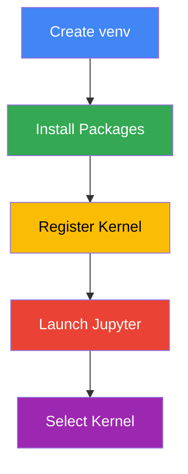
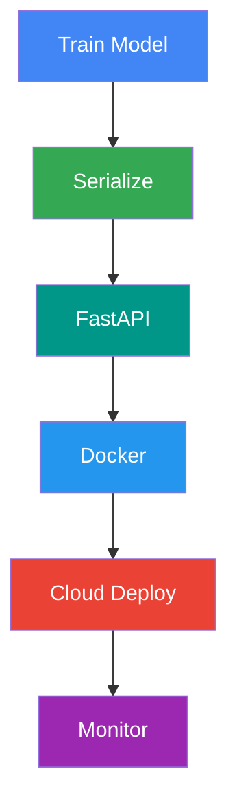
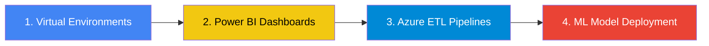

<p align="center">
  
</p>

<div align="center">

# 📚 Data Science Tutorials & Guides

### *From Fundamentals to Production - A Complete Learning Path*

[](https://www.python.org/)
[](https://jupyter.org/)
[](https://azure.microsoft.com/)
[](LICENSE)

[](https://github.com/coder-akram-khan/data-stack-guides/stargazers)
[](https://github.com/coder-akram-khan/data-stack-guides/network/members)
[](https://github.com/coder-akram-khan/data-stack-guides/issues)

</div>


## 🎯 What You'll Find Here

<table>
<tr>
<td width="50%" valign="top">

### 📖 **Comprehensive Tutorials**
Step-by-step guides covering everything from environment setup to production deployment.

### 🛠️ **Production-Ready Code**
Real-world examples with working code, scripts, and Jupyter notebooks you can run immediately.

### 🎓 **Best Practices**
Industry-standard approaches used by professional data scientists and ML engineers.

</td>
<td width="50%" valign="top">

### 💡 **Problem-Focused Learning**
Each tutorial solves real problems you'll face in your data science journey.

### 🔄 **Continuously Updated**
New tutorials added regularly. Content updated with latest tools and practices.

### 🤝 **Community-Driven**
Built with feedback from developers, data scientists, and learners worldwide.

</td>
</tr>
</table>


## 📑 Table of Contents

- [Available Tutorials](#-available-tutorials)
  - [Python & Development Environment](#-python--development-environment)
  - [Cloud & Data Engineering](#️-cloud--data-engineering)
  - [Data Visualization & BI](#-data-visualization--bi)
  - [Machine Learning & AI](#-machine-learning--ai)
- [Quick Start](#-quick-start)
- [Learning Path](#-learning-path)
- [How to Use](#-how-to-use)
- [Contributing](#-contributing)
- [Support](#-support)
- [Connect](#-connect)


## 📖 Available Tutorials

### 🐍 Python & Development Environment

<table>
<tr>
<td width="60%">

#### **[Using Virtual Environments as Jupyter Kernels](./jupyter-virtual-environments)**

<p align="left">
  
  
  
</p>

**The Problem:** Your Python packages are installed but Jupyter can't find them. Learn the professional way to manage virtual environments with Jupyter - no Anaconda needed.

**What You'll Learn:**
- ✅ Create and activate virtual environments
- ✅ Install packages in isolated environments
- ✅ Register environments as Jupyter kernels
- ✅ Switch between different project environments
- ✅ Troubleshoot common issues

**Perfect For:** Data scientists tired of dependency conflicts, developers working on VMs, teams needing lightweight setups.

**Tech Stack:** Python • venv • Jupyter • ipykernel

</td>
<td width="40%" align="center">



**Quick Stats:**
- 📊 Production-Ready
- 🚀 VM-Optimized
- ⚡ Lightweight
- 💯 Industry Standard

</td>
</tr>
</table>


### ☁️ Cloud & Data Engineering

<table>
<tr>
<td width="60%">

#### **[Building ETL Pipelines with Azure Data Factory](./azure-etl-pipelines)**

<p align="left">
  
  
  
</p>

**The Problem:** Moving data from on-premises to cloud manually is time-consuming and error-prone. Build automated, scalable ETL pipelines.

**What You'll Learn:**
- ⏳ Design data pipeline architecture
- ⏳ Azure Data Factory fundamentals
- ⏳ Connect to multiple data sources
- ⏳ Transform data using Databricks
- ⏳ Schedule and monitor pipelines
- ⏳ Handle errors and logging

**Perfect For:** Data engineers moving to cloud, businesses modernizing data infrastructure, teams scaling data operations.

**Tech Stack:** Azure Data Factory • Azure Databricks • PySpark • Azure Storage

</td>
<td width="40%" align="center">


**Coming Features:**
- 📦 Sample datasets
- 🔧 ARM templates
- 📊 Cost optimization
- 🎯 Best practices

</td>
</tr>
</table>


### 📊 Data Visualization & BI

<table>
<tr>
<td width="60%">

#### **[Power BI Dashboard Best Practices](./power-bi-dashboards)**

<p align="left">
  
  
  
</p>

**The Problem:** Your dashboards are cluttered, slow, and nobody uses them. Learn to design dashboards that drive decisions.

**What You'll Learn:**
- ⏳ Dashboard design principles
- ⏳ DAX formula essentials
- ⏳ Performance optimization
- ⏳ Interactive visualizations
- ⏳ Mobile-responsive layouts
- ⏳ Publishing and sharing strategies

**Perfect For:** Business analysts, data analysts, anyone creating reports and dashboards.

**Tech Stack:** Power BI Desktop • DAX • M Query • Power BI Service

</td>
<td width="40%" align="center">

**Dashboard Principles:**

```
┌─────────────────┐
│  KPIs at Top    │ 📈
├─────────────────┤
│  Main Viz       │ 📊
│  (Largest)      │
├─────────────────┤
│  Supporting     │ 📉
│  Charts         │
└─────────────────┘
```

**Key Metrics:**
- 🎯 User engagement
- ⚡ Load time < 3s
- 📱 Mobile-first
- 🎨 Brand consistency

</td>
</tr>
</table>


### 🤖 Machine Learning & AI

<table>
<tr>
<td width="60%">

#### **[ML Model Deployment with Docker & FastAPI](./ml-model-deployment)**

<p align="left">
  
  
  
</p>

**The Problem:** Your ML model works in Jupyter but needs to serve predictions in production. Deploy models as scalable APIs.

**What You'll Learn:**
- ⏳ Serialize ML models
- ⏳ Build REST APIs with FastAPI
- ⏳ Containerize with Docker
- ⏳ Deploy to cloud (Azure/AWS)
- ⏳ Monitor model performance
- ⏳ Handle versioning and rollbacks

**Perfect For:** ML engineers, data scientists moving to production, teams needing model APIs.

**Tech Stack:** FastAPI • Docker • scikit-learn • Azure App Service • CI/CD

</td>
<td width="40%" align="center">



**Production Ready:**
- 🔒 Authentication
- 📊 Logging
- ⚡ Performance
- 🔄 Auto-scaling

</td>
</tr>
</table>


## 🚀 Quick Start

### Prerequisites

Before starting any tutorial, ensure you have:

```bash
# Python 3.8 or higher
python --version

# Git (for cloning)
git --version

# Text editor or IDE (VS Code recommended)
```

### Clone This Repository

```bash
git clone https://github.com/coder-akram-khan/data-science-tutorials.git
cd data-science-tutorials
```

### Navigate to a Tutorial

```bash
# Example: Virtual Environments tutorial
cd jupyter-virtual-environments

# Read the README
cat README.md

# Run setup script (if available)
./scripts/setup_venv.sh  # Linux/macOS
# or
scripts\setup_venv.bat  # Windows
```


## 🎓 Learning Path

### Recommended Order for Beginners



<table>
<tr>
<td width="25%" align="center">

**🟢 Beginner**

Start here if you're new to data science or Python development.

- Virtual Environments
- Power BI Basics

</td>
<td width="25%" align="center">

**🟡 Intermediate**

Good foundation in Python and comfortable with cloud basics.

- Azure ETL Pipelines
- Advanced Power BI

</td>
<td width="25%" align="center">

**🟠 Advanced**

Experienced with ML and ready for production deployment.

- ML Model Deployment
- Pipeline Optimization

</td>
<td width="25%" align="center">

**🔴 Expert**

Building at scale with production systems.

- Custom tutorials
- Contribute your own!

</td>
</tr>
</table>

### By Topic

- **🐍 Python Development:** Start with Virtual Environments
- **☁️ Cloud Engineering:** Jump to Azure ETL Pipelines
- **📊 Business Intelligence:** Begin with Power BI Dashboards
- **🤖 Machine Learning:** Start with Virtual Environments, then ML Deployment


## 💡 How to Use This Repository

### For Self-Learners

1. **Browse** tutorials above and pick one that matches your goals
2. **Clone** the repository to your local machine
3. **Navigate** to the tutorial folder
4. **Follow** the step-by-step README
5. **Practice** with provided examples and notebooks
6. **Experiment** by modifying code and trying variations

### For Teams & Companies

1. **Fork** this repository to your organization
2. **Customize** tutorials for your tech stack
3. **Add** company-specific examples and datasets
4. **Use** as onboarding material for new hires
5. **Contribute** improvements back to the community

### For Instructors

1. **Use** tutorials as course material
2. **Assign** tutorials as homework assignments
3. **Adapt** content for your curriculum
4. **Share** with attribution (MIT License)
5. **Contribute** educational improvements


## 📂 Repository Structure

```
data-science-tutorials/
│
├── README.md                          # You are here
├── LICENSE                            # MIT License
├── .gitignore                         # Git ignore rules
│
├── jupyter-virtual-environments/      # Tutorial: Virtual Environments
│   ├── README.md                     # Complete tutorial
│   ├── assets/
│   │   └── images/                   # Screenshots, diagrams
│   ├── examples/
│   │   ├── requirements.txt          # Python dependencies
│   │   └── sample_notebook.ipynb     # Example notebook
│   └── scripts/
│       ├── setup_venv.sh            # Linux/macOS setup
│       └── setup_venv.bat           # Windows setup
│
├── azure-etl-pipelines/              # Tutorial: Azure ETL (Coming Soon)
├── power-bi-dashboards/              # Tutorial: Power BI (Coming Soon)
└── ml-model-deployment/              # Tutorial: ML Deployment (Coming Soon)
```

### Tutorial Folder Structure

Each tutorial follows the same structure for consistency:

```
tutorial-name/
├── README.md              # Full tutorial content
├── assets/
│   ├── images/           # Visual aids
│   └── videos/           # Video demos (optional)
├── examples/
│   ├── requirements.txt  # Dependencies
│   ├── *.ipynb          # Jupyter notebooks
│   └── *.py             # Python scripts
└── scripts/              # Automation scripts
    ├── setup.*          # Setup scripts
    └── cleanup.*        # Cleanup scripts
```


## 🤝 Contributing

### We Welcome Contributions!

<table>
<tr>
<td width="33%" align="center">

### 📝 **Add Tutorials**

Share your knowledge by contributing new tutorials on data science topics.

</td>
<td width="33%" align="center">

### 🐛 **Report Issues**

Found a bug or error? Open an issue and help us improve.

</td>
<td width="33%" align="center">

### ✨ **Improve Content**

Enhance existing tutorials with better examples or explanations.

</td>
</tr>
</table>

### How to Contribute

1. **Fork** this repository
2. **Create** a new branch: `git checkout -b feature/your-tutorial`
3. **Add** your content following our structure
4. **Test** all code examples
5. **Commit** changes: `git commit -m "Add: Tutorial on [topic]"`
6. **Push** to your fork: `git push origin feature/your-tutorial`
7. **Submit** a Pull Request

### Contribution Guidelines

- ✅ **Clear Instructions:** Step-by-step, beginner-friendly
- ✅ **Working Code:** All examples tested and functional
- ✅ **Visual Aids:** Include screenshots where helpful
- ✅ **Proper Attribution:** Credit sources and inspirations
- ✅ **MIT License:** All contributions under MIT License

### Tutorial Proposal Template

```markdown
## Tutorial Title

**Problem:** What problem does this solve?
**Target Audience:** Who is this for?
**Prerequisites:** What knowledge is needed?
**Tech Stack:** Tools and technologies used
**Estimated Time:** How long to complete?
```


## 📊 Tutorial Status & Roadmap

<table>
<tr>
<th>Tutorial</th>
<th>Status</th>
<th>Priority</th>
<th>Target Date</th>
</tr>
<tr>
<td>Virtual Environments & Jupyter</td>
<td></td>
<td>High</td>
<td>✅ Released</td>
</tr>
<tr>
<td>Azure ETL Pipelines</td>
<td></td>
<td>High</td>
<td>March 2024</td>
</tr>
<tr>
<td>Power BI Dashboards</td>
<td></td>
<td>Medium</td>
<td>April 2024</td>
</tr>
<tr>
<td>ML Model Deployment</td>
<td></td>
<td>High</td>
<td>April 2024</td>
</tr>
<tr>
<td>SQL Query Optimization</td>
<td></td>
<td>Medium</td>
<td>May 2024</td>
</tr>
<tr>
<td>Streamlit Dashboard Development</td>
<td></td>
<td>Low</td>
<td>June 2024</td>
</tr>
</table>

### Upcoming Topics (Vote via Issues!)

- 🗳️ Time Series Forecasting with Prophet
- 🗳️ NLP Text Classification Pipeline
- 🗳️ Computer Vision with PyTorch
- 🗳️ Real-time Data Streaming with Kafka
- 🗳️ Feature Engineering Best Practices

**Want to see a specific tutorial?** [Open an issue](https://github.com/coder-akram-khan/data-science-tutorials/issues/new) with the `tutorial-request` label!


## ⭐ Support This Project

### Show Your Appreciation

<table>
<tr>
<td width="33%" align="center">

### ⭐ **Star This Repo**

Help others discover these tutorials by starring the repository.

[](https://github.com/coder-akram-khan/data-stack-guides)

</td>
<td width="33%" align="center">

### 🔁 **Share**

Share these tutorials with your network, team, or students.

[](https://twitter.com/intent/tweet?text=Check%20out%20these%20amazing%20data%20science%20tutorials!&url=https://github.com/coder-akram-khan/data-stack-guides)

</td>
<td width="33%" align="center">

### 💬 **Feedback**

Your feedback helps improve these tutorials. Open issues or discussions!

[](https://github.com/coder-akram-khan/data-stack-guides/issues)

</td>
</tr>
</table>

### Ways to Help

- 📖 **Use the tutorials** and provide feedback
- 🐛 **Report bugs** or unclear instructions
- 💡 **Suggest improvements** or new topics
- 🤝 **Contribute** your own tutorials
- 🌟 **Sponsor** this project (optional)


## 📫 Connect & Community

<div align="center">

### Get in Touch

<table>
<tr>
<td align="center">

[](https://linkedin.com/in/mr-akram-khan)

**Connect professionally**  
Network and discuss data science

</td>
<td align="center">

[](https://github.com/coder-akram-khan)

**Follow for updates**  
See my latest projects

</td>
<td align="center">

[](mailto:akram.codes.it@gmail.com)

**Direct contact**  
For collaboration inquiries

</td>
</tr>
</table>

</div>

### Join the Discussion

- 💬 **GitHub Discussions:** Ask questions, share ideas
- 🐛 **GitHub Issues:** Report bugs, request features
- 🌐 **Community Forum:** Coming soon!


## 👨‍💻 About the Author

<div align="center">


### **Akram Khan**

**Data Analyst | ML Engineer**

</div>

I'm passionate about making data science accessible through clear, practical tutorials. With experience in analytics, machine learning, and cloud technologies, I create content that bridges the gap between theory and production.

**Specializations:**
- 📊 Business Analytics & BI
- 🤖 Machine Learning & AI
- ☁️ Azure Cloud Architecture
- 🐍 Python Development
- 📈 Data Visualization

**Why I Create These Tutorials:**
> "I've spent countless hours debugging environments, figuring out deployments, and learning from scattered resources. These tutorials are what I wish I had when I started - comprehensive, practical, and production-ready."

📫 **Connect with me:**
- GitHub: [@coder-akram-khan](https://github.com/coder-akram-khan)
- LinkedIn: [Akram Khan](https://linkedin.com/in/mr-akram-khan)
- Email: akram.codes.it@gmail.com


## 📄 License

This project is licensed under the **MIT License** - see the [LICENSE](LICENSE) file for details.

### What This Means

✅ **Commercial Use:** Use in commercial projects  
✅ **Modification:** Modify and adapt content  
✅ **Distribution:** Share with others  
✅ **Private Use:** Use for personal projects  

**Requirements:**
- Include the original license and copyright notice
- Provide attribution when sharing


## 🙏 Acknowledgments

Special thanks to:

- **Contributors:** Everyone who has contributed tutorials and improvements
- **Community:** Data science community for feedback and suggestions
- **Open Source:** Projects that inspire and enable this work
- **You:** For using these tutorials and investing in your learning


## 📈 Repository Stats

<div align="center">


<table>
<tr>
<td align="center">

**🌟 Stars**


</td>
<td align="center">

**🍴 Forks**


</td>
<td align="center">

**👁️ Watchers**


</td>
<td align="center">

**📝 Tutorials**


</td>
</tr>
</table>

</div>


<div align="center">

## 🚀 Ready to Start Learning?

**Pick a tutorial above and begin your journey!**

[](#-available-tutorials)
[](https://github.com/coder-akram-khan/data-stack-guides)
[](https://github.com/coder-akram-khan/data-stack-guides/issues)

---

### *"The best time to start learning was yesterday. The second best time is now."*

---

**Last Updated:** February 2026 | **Version:** 1.0.0

Made with ❤️ by [Akram Khan](https://github.com/coder-akram-khan)

</div>
